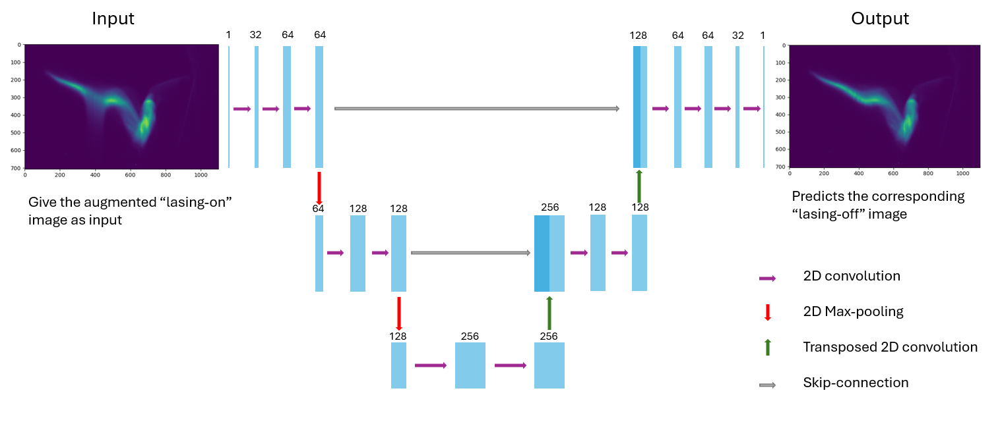
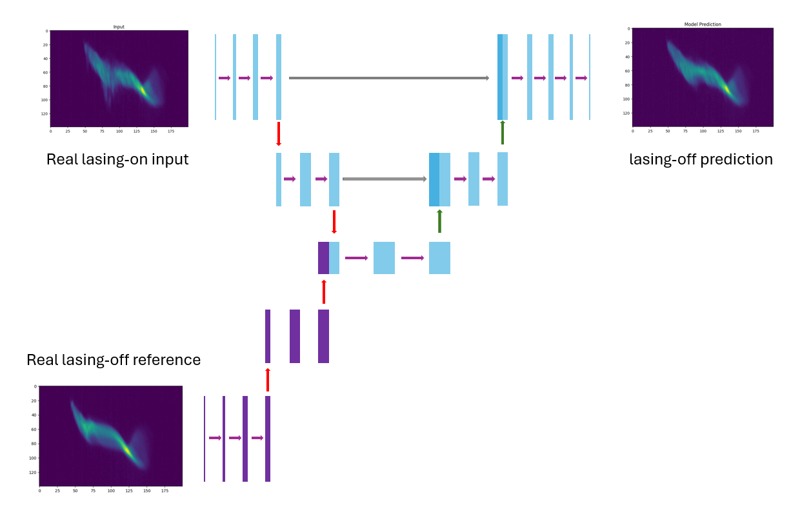

# PolariX-Unet
A U-Net architecture implementation for the recreation of PolariX lasing-off images. This can be used to determine the Self-Amplified Spontaneous Emission (SASE) pulse profile and energy. 

[See this presentation for more details](PolariX_Analysis_Electron_Bunch_Diagnostics_Workshop.pdf)

# Training sample generation
The training samples were synthetically generated from SASE-off images through 2 different methods. 
- Subtract and add Gaussian distribution from different positions of vertical slices of the image.
- Convolve with an asymmetric function (like gamma function) to get a distribution with a long tail.
  
# Models
Two models are used for this task. 

## U-net Architecture
A standard U-net architecture to take in the SASE-on image and predict the SASE-off image, identifying the characteristic features of SASE emission. This would need fine-tuning when testing on new data since the electron bucnh shape varies between runs. 

## Y-net Architecture
Since the shape of the electron distribution varies between runs, a 'Y-net' architecture takes in both a SASE-on image and a reference SASE-off image to predict the corresponding SASE-off image.

